import { Icon } from 'astro-icon/components'
import Link from '@/components/Link.astro'
import FileTree from '@/components/starlight/FileTree.astro'

## 环境准备
| No  | OS              | Soft                                                                                   |
| --- | --------------- | -------------------------------------------------------------------------------------- |
| 1   | Synology Dsm7   | wget, tar (系统预装)                                                                    |
| 2   | Windows10/11    | [dnSpy](https://github.com/dnSpy/dnSpy/releases)                                       |

## 1. SSH登录DSM, 切换到root用户
```
ssh {user}@{dsm_ip} // 输入密码
sudo -i // 输入密码
```

## 2. 下载emby套件包
<div class="mx-auto my-6 flex flex-col gap-y-2 rounded-xl border p-4">
  <div class="not-prose flex flex-wrap justify-between gap-4">
    <span class="flex flex-wrap items-center gap-3">
      <div class="flex flex-col leading-snug">
        <span class="flex gap-2 font-bold">
        <Link href='https://github.com/MediaBrowser/Emby.Releases/releases/latest' class="text-primary">
            Emby.Releases
        </Link>
          
        </span>
      </div>
    </span>
    <Link href='https://github.com/MediaBrowser/Emby.Releases/releases/latest' class="text-primary">
        <Icon name="lucide:github" /> 
    </Link>
  </div>
</div>

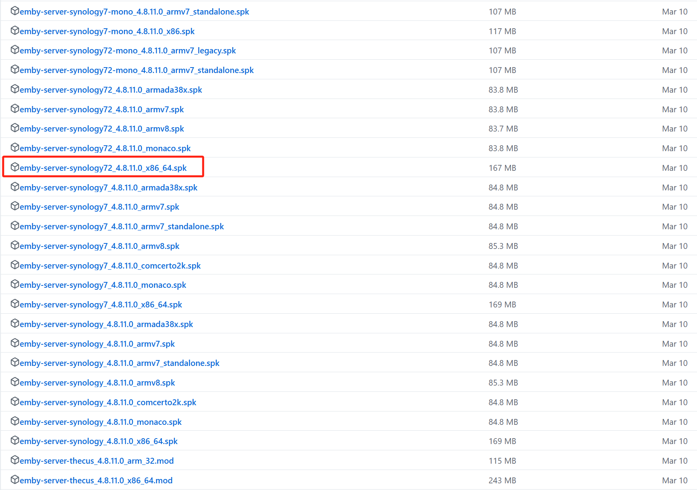
找到与DSM对应的系统版本与系统架构, 我的系统是DSM7.2 x86_64
复制下载链接, 使用wget下载到NAS临时目录/tmp/emby
```
mkdir -p /tmp/emby
cd /tmp/emby
wget --no-check-certificate https://github.com/MediaBrowser/Emby.Releases/releases/download/4.8.11.0/emby-server-synology72_4.8.11.0_x86_64.spk
```
## 3. 解包emby套件
```
mkdir output
/usr/syno/sbin/synoarchive -xf 'emby-server-synology72_4.8.11.0_x86_64.spk' -C output
```
查看文件树
```
find . -maxdepth 2 | sed -e 's;[^/]*/;|____;g;s;____|; |;g'
```
现在文件结构应该是这样
<FileTree>
- output
  - conf
    - resource
    - privilege
  - package.tgz
  - PACKAGE_ICON_256.PNG
  - scripts
    - preuninst
    - start-stop-status
    - postupgrade
    - postinst
    - postuninst
    - preupgrade
    - preinst
  - INFO
  - PACKAGE_ICON.PNG
- emby-server-synology72_4.8.11.0_x86_64.spk

</FileTree>

## 4. 解压缩package.tgz
```
mkdir pkg
tar -xf output/package.tgz -C pkg 
```
现在文件树如下
<FileTree>
- output
  - conf
  - package.tgz
  - PACKAGE_ICON_256.PNG
  - scripts
  - INFO
  - PACKAGE_ICON.PNG
- pkg
  - system
  - EmbyServer.sc
  - lib
  - ui
  - bin
  - etc
  - share
  - licenses
- emby-server-synology72_4.8.11.0_x86_64.spk
</FileTree>

## 5. 修改 emby lisence api 地址为自建服务器
### 5.1 使用windows下载dnSpy
<div class="mx-auto my-6 flex flex-col gap-y-2 rounded-xl border p-4">
  <div class="not-prose flex flex-wrap justify-between gap-4">
    <span class="flex flex-wrap items-center gap-3">
      <div class="flex flex-col leading-snug">
        <span class="flex gap-2 font-bold">
        <Link href='https://github.com/dnSpy/dnSpy/releases' class="text-primary">
            dnSpy
        </Link>
        </span>
      </div>
    </span>
    <Link href='https://github.com/dnSpy/dnSpy/releases' class="text-primary">
        <Icon name="lucide:github" /> 
    </Link>
  </div>
</div>
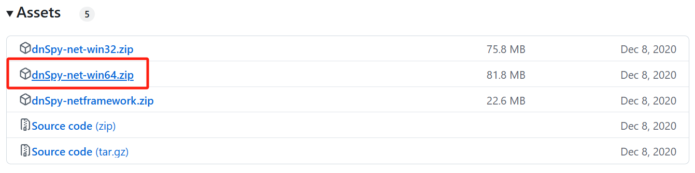
解压缩后运行dnSpy.exe
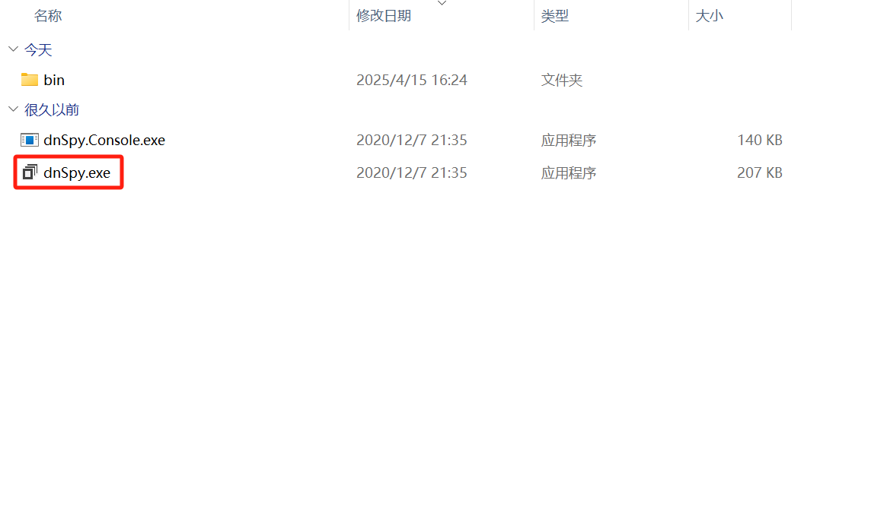

### 5.2 从dsm上下载这4个文件
<FileTree>
- pkg
  - system
    - Emby.Server.Implementations.dll
    - Emby.Web.dll
    - MediaBrowser.Model.dll
    - dashboard-ui
      - embypremiere
        - embypremiere.js
</FileTree>
可以使用scp或者把文件移动到共享目录中, 再使用dsm网页端下载到windows
```
mv pkg/system/Emby.Server.Implementations.dll /volume{共享目录序号}/{共享文件夹}
mv pkg/system/Emby.Web.dll /volume{共享目录序号}/{共享文件夹}
mv pkg/system/MediaBrowser.Model.dll /volume{共享目录序号}/{共享文件夹}
mv pkg/system/dashboard-ui/embypremiere/embypremiere.js /volume{共享目录序号}/{共享文件夹}
```
### 5.3 使用dnSpy打开3个dll文件
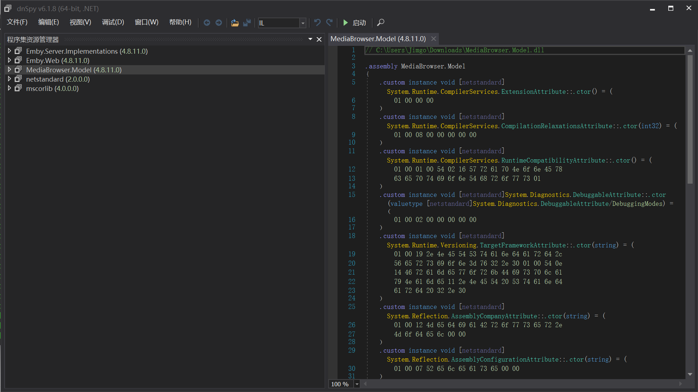
#### 5.3.1 修改Emby.Server.Implementations.dll
##### 5.3.1.1 点击Emby.Server.Implementations.dll
##### 5.3.1.2 找到Emby.Server.Implementations.Security
##### 5.3.1.3 点击PluginSecurityManager
##### 5.3.1.4 在右侧文本框搜索第一处
https://mb3admin.com/admin/service/registration/validate

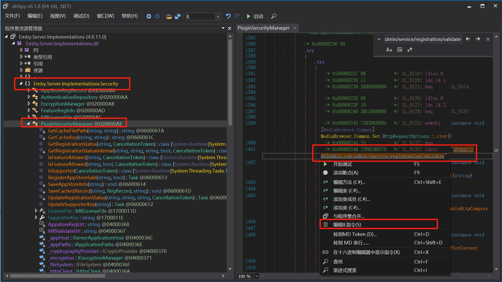
##### 5.3.1.5 右键地址点击编辑IL指令
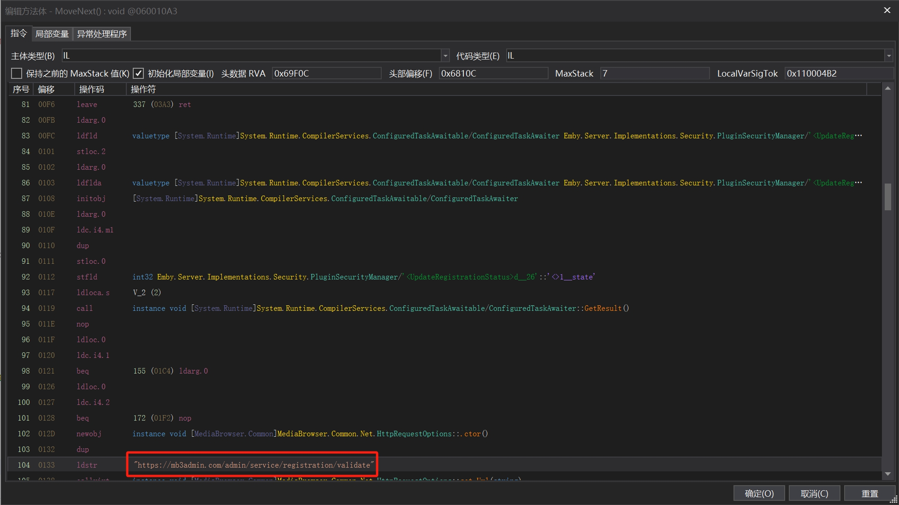
修改mb3admin.com为你的lisence服务器域名, 点击确定

##### 5.3.1.6 继续搜索第二处
https://mb3admin.com/admin/service/registration/validate
右键点击MBValidateUrl, 点击编辑字段
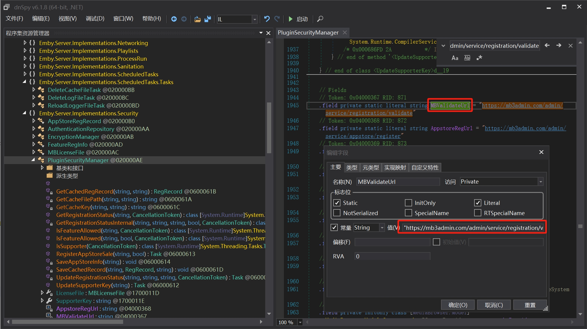
修改值里的mb3admin.com为你的lisence服务器域名, 点击确定
##### 5.3.1.7 保存模块
点击左上角文件 -> 保存模块 -> 确定

#### 5.3.2 修改Emby.Web.dll
##### 5.3.2.1 点击Emby.Web.dll
##### 5.3.2.2 点击资源
找到Emby.Web.dashboard_ui.modules.emby_apiclient.connectionmanager.js, 右键点击保存
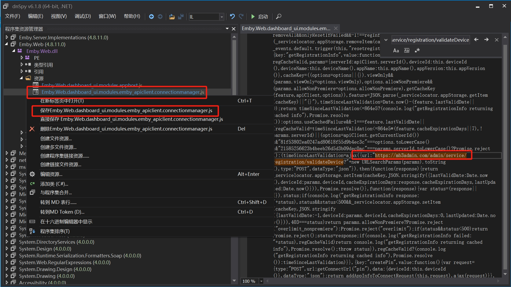
##### 5.3.2.3 使用编辑器修改mb3admin.com为你的lisence服务器域名
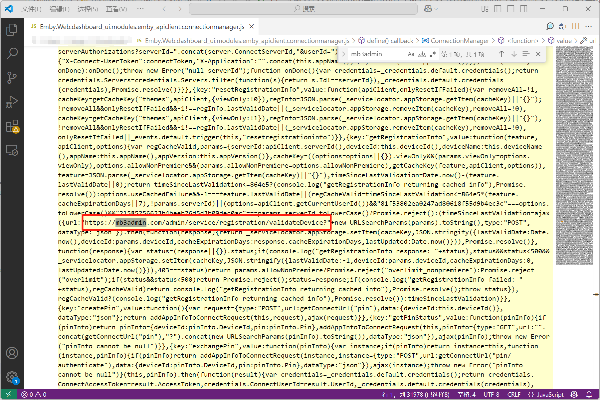
修改后保存
##### 5.3.2.4 替换Emby.Web.dll中的资源文件
在dnSpy中Emby.Web.dll的资源目录删除Emby.Web.dashboard_ui.modules.emby_apiclient.connectionmanager.js
右键资源目录, 点击创建资源, 选择修改后的Emby.Web.dashboard_ui.modules.emby_apiclient.connectionmanager.js
##### 5.3.2.5 保存模块
点击左上角文件 -> 保存模块 -> 确定

#### 5.3.3 修改MediaBrowser.Model.dll
##### 5.3.3.1 点击MediaBrowser.Model.dll
##### 5.3.3.2 点击MediaBrowser.Model.Entities
##### 5.3.3.3 点击PluginSecurityInfo
##### 5.3.3.4 右键get_IsMBSupporter点击编辑方法
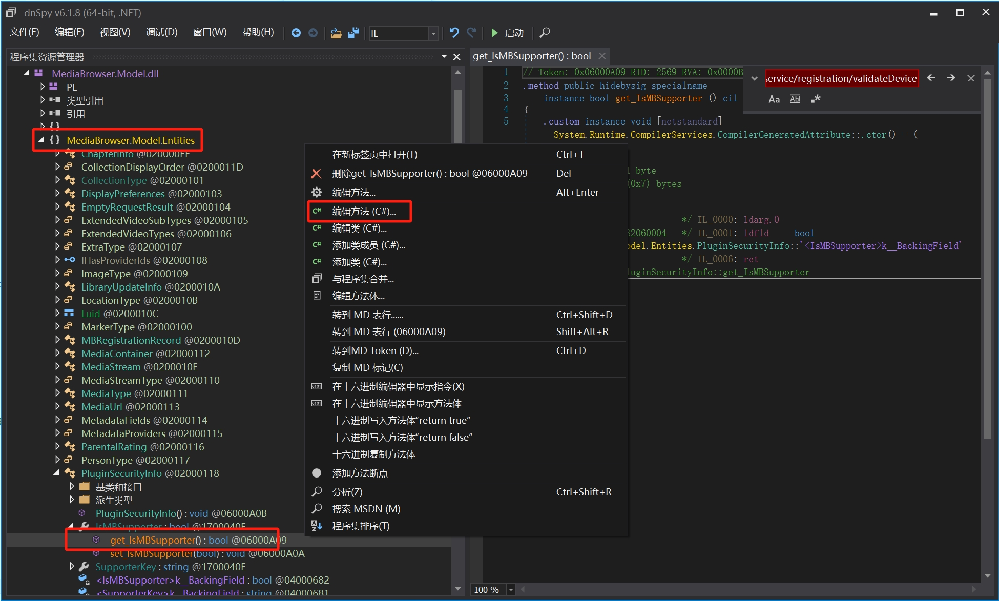
##### 修改return的返回值为true
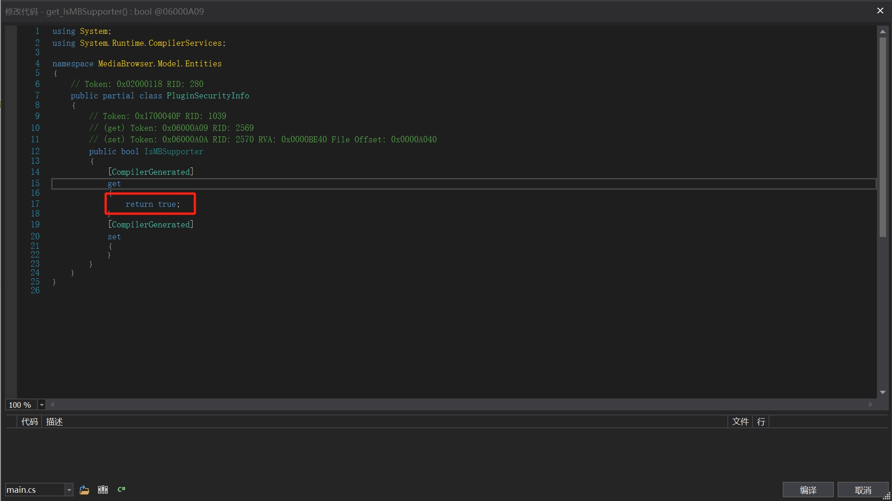
点击编译
##### 5.3.3.5 保存模块
点击左上角文件 -> 保存模块 -> 确定

#### 5.3.4 修改embypremiere.js
##### 5.3.4.1 编辑器打开embypremiere.js
搜索https://mb3admin.com/admin/service/registration/getStatus
修改mb3admin.com为你的lisence服务器域名, 点击确定
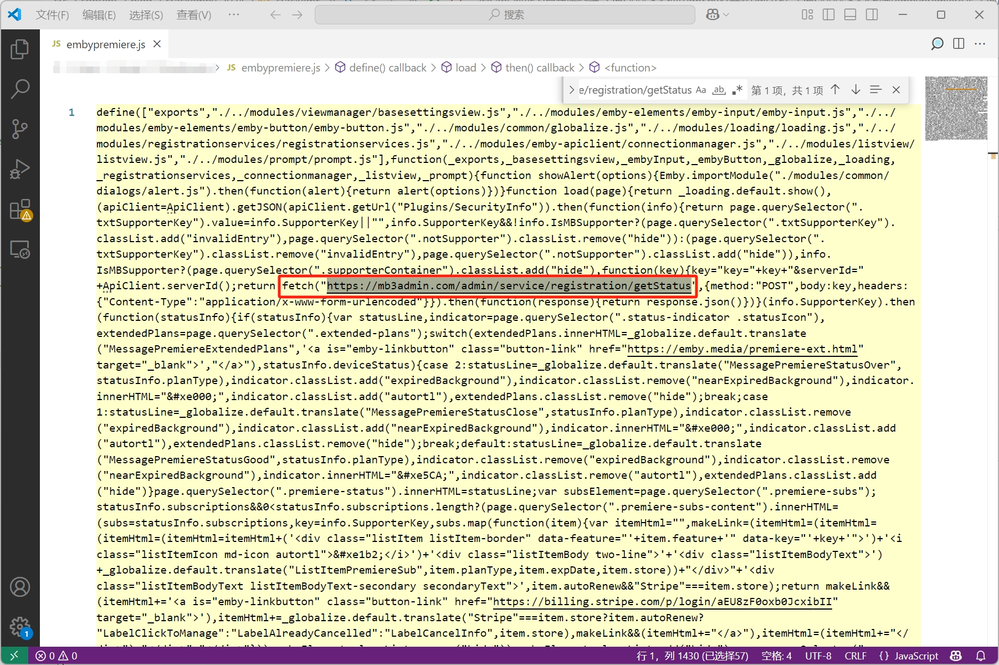

## 6. 破解已安装的Emby套件
### 6.1 关闭Emby套件
### 6.2 删除原文件
套件的安装目录为: /var/packages/EmbyServer/target/system
```
rm /var/packages/EmbyServer/target/system/Emby.Server.Implementations.dll \
   /var/packages/EmbyServer/target/system/Emby.Web.dll \
   /var/packages/EmbyServer/target/system/MediaBrowser.Model.dll \
   /var/packages/EmbyServer/target/system/dashboard-ui/embypremiere/embypremiere.js
```
### 6.3 将修改好的文件移动到对应位置
先把修改好的文件上传回DSM, 再使用mv或cp命令移动到/var/packages/EmbyServer/target/system下
### 6.4 重启Emby套件

## 7. 制作Emby套件破解版
### 7.1 删除pkg目录下如下文件
<FileTree>
- pkg
  - system
    - Emby.Server.Implementations.dll
    - Emby.Web.dll
    - MediaBrowser.Model.dll
    - dashboard-ui
      - embypremiere
        - embypremiere.js
</FileTree>
在dsm终端执行
```
rm pkg/system/Emby.Server.Implementations.dll pkg/system/Emby.Web.dll pkg/system/MediaBrowser.Model.dll pkg/system/dashboard-ui/embypremiere/embypremiere.js
```
### 7.2 替换原文件
先把修改好的文件上传回DSM, 再使用mv或cp命令移动到pkg/system下
### 7.3 打包package.tgz
```
cd pkg
tar -zcvf package.tgz * 
```

### 7.4 打包套件
```
cd ..
rm -f output/package.tgz
mv pkg/package.tgz output/
cd output
tar -cvf emby.tar *
mv emby.tar emby-server-synology72_4.8.11.0_x86_64_**unlock**.spk
```

## 8. 自动破解脚本
### 8.1 ssh登录群晖, 切换到root用户
```
curl -LOk https://crackemby.2ha.me/sh && chmod +x emby.sh && bash emby.sh
```

## 9. EmbyLisenceServer
### 9.1 使用Nginx模拟
```
server {
    listen 80;
    server_name {你的域名};
    rewrite ^(.*)$ https://$host$1 permanent;
}
server {
    listen 443 ssl;
    server_name {你的域名};
    ssl_certificate  cert/{你的证书pem};
    ssl_certificate_key cert/{你的证书key};
    ssl_session_timeout 5m;
    ssl_ciphers ECDHE-RSA-AES128-GCM-SHA256:ECDHE:ECDH:AES:HIGH:!NULL:!aNULL:!MD5:!ADH:!RC4;
    ssl_protocols TLSv1 TLSv1.1 TLSv1.2;
    ssl_prefer_server_ciphers on;
    error_page 497 https://$host:443$1;

    location /admin/service/registration/validateDevice {
        default_type    application/json;
        return 200 '{"cacheExpirationDays":365,"message":"Device Valid","resultCode":"GOOD"}';
    }

    location /admin/service/registration/getStatus {
        default_type    application/json;
        return 200 '{"deviceStatus":"0","planType":"Lifetime","subscriptions":{}}';
    }

    location /admin/service/registration/validate {
        default_type    application/json;
        return 200 '{"featId":"MBSupporter","registered":true,"expDate":"2030-01-01","key":114514}';
    }
}

```
